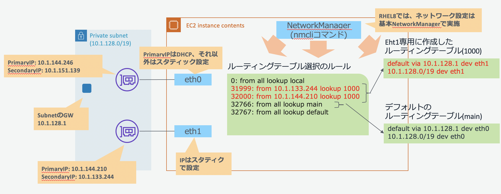

# RHEL8で複数NIC、複数IPでのNetworkManager設定の実機検証結果
## 構成
Linuxでは、OS(カーネル)で複数のルーティングテーブルを用意し、ポリシールールに従い利用するルーティングテーブルを選択できる機能があります(ポリシーベースのルーティング機能)。
複数ENI構成の場合は、eth1専用にルーティングテーブルを作成し、通信元のIPアドレスがeht1上の場合は、eth1専用のルーティングテーブルを利用するようにポリシーベースのルールで振り分けを行うようにします。
またネットワーク設定はRHEL8では、NetworkManagerでの設定が基本となるため、NetworkManagerを利用し検証を実施ししました。


## 手順
### (1)インスタンス作成
bashとAWS CLIが利用可能な環境でENIを２つアタッチし、それぞれのENIでプライベートIPアドレスを２個持つRHEL8のインスタンスを作成します。
- インスタンス作成に必要なパラメータ設定
```shell
インスタンスの作成
PROFILE="default"                   #AWS CLIのプロファイル指定

KEYNAME="CHANGE_KEY_PAIR_NAME"      #環境に合わせてキーペア名を設定してください。
INSTANCE_TYPE="t2.micro"
SUBNETID="subnet-0f749f5bbba38d36c" #環境に合わせてサブネットIDを変更
SGID="sg-0d9a558782eb72e22"         #環境に合わせてセキュリティーグループIDを変更
HOSTNAME="rhel8-nic2-test"
  
#最新のAmazon Linux2のAMI IDを取得します。
RHEL8_AMIID=$(aws --profile ${PROFILE} --output text \
    ec2 describe-images \
        --filters 'Name=name,Values=RHEL-8.?.?_HVM-????????-x86_64-?-Hourly2-GP2' \
                  'Name=state,Values=available' \
    --query 'reverse(sort_by(Images, &CreationDate))[:1].ImageId' ) ;

#設定内容の確認
echo -e "KEYNAME      = ${KEYNAME}\nINSTANCE_TYPE= ${INSTANCE_TYPE}\nSUBNETID     = ${SUBNETID}\nSGID         = ${SGID}\nRHEL8_AMIID  = ${RHEL8_AMIID}\nHOSTNAME     = ${HOSTNAME}"
```
- インスタンスの起動
```shell
#インスタンスの作成
#タグ設定
TAGJSON='
[    
    {        
        "ResourceType": "instance",
        "Tags": [
            {
                "Key": "Name",
                "Value": "'"${HOSTNAME}"'"
            }
        ]
    }
]'

#ユーザデータ設定(ホスト名の設定)
USER_DATA='#!/bin/bash -xe
yum -y update
hostnamectl set-hostname '"${HOSTNAME}"'
'
#インターフェース設定(ENIを２つアタッチし、ENIあたり２個のPrivateIPAddressを付与)
INTERFACE_JSON='[
  {
    "DeviceIndex": 0,
    "DeleteOnTermination": true,
    "Description": "primary interface",
    "SubnetId": "'"${SUBNETID}"'",
    "InterfaceType": "interface",
    "Groups": [ "'"${SGID}"'" ],
    "SecondaryPrivateIpAddressCount": 1
  },
  {
    "DeviceIndex": 1,
    "DeleteOnTermination": true,
    "Description": "secondary interface",
    "SubnetId": "'"${SUBNETID}"'",
    "InterfaceType": "interface",
    "Groups": [ "'"${SGID}"'" ],
    "SecondaryPrivateIpAddressCount": 1
  }
]'

# サーバの起動
aws --profile ${PROFILE} \
    ec2 run-instances \
        --image-id ${RHEL8_AMIID} \
        --instance-type ${INSTANCE_TYPE} \
        --key-name ${KEYNAME} \
        --network-interfaces "${INTERFACE_JSON}" \
        --tag-specifications "${TAGJSON}" \
        --user-data "${USER_DATA}" ;
作成したインスタンスのネットワーク構成確認
aws --profile ${PROFILE} \
    ec2 describe-instances \
        --filters "Name=tag:Name,Values=${HOSTNAME}" \
                  "Name=instance-state-name,Values=running" \
    --query 'sort_by(Reservations[].Instances[].NetworkInterfaces[], &Attachment.DeviceIndex)[].{id:Attachment.DeviceIndex,networkid:NetworkInterfaceId,Mac:MacAddress,PrimIp:PrivateIpAddress,ips:PrivateIpAddresses[].PrivateIpAddress}'
``` 
- 実行結果例

```shell
[
    {
        "id": 0,
        "networkid": "eni-00f1631b3adf80546",
        "Mac": "06:5f:be:3b:ed:72",
        "PrimIp": "10.1.144.246",
        "ips": [
            "10.1.144.246",
            "10.1.151.139"
        ]
    },
    {
        "id": 1,
        "networkid": "eni-0ff99886f57aaf9f6",
        "Mac": "06:60:81:a9:9a:58",
        "PrimIp": "10.1.144.210",
        "ips": [
            "10.1.144.210",
            "10.1.133.244"
        ]
    }
]
```

### (2)構成確認
- 作成したEC2インスタンスに`ec2-user`でログインする
- ログイン後に、ネットワークインターフェース構成を確認する
OS(kernel)で認識しているネットワークデバイスを確認する。今回の構成では、以下のようにeth0とeth1の２つのネットワークデバイスが存在することが確認できる。
```shell
ls  /sys/class/net/
eth0  eth1  lo
```
- それぞれのデバイスのMACアドレスを確認する
```shell
cat /sys/class/net/eth0/address
06:5f:be:3b:ed:72

$ cat /sys/class/net/eth1/address
06:60:81:a9:9a:58
```
- 初期状態でOSに付与されているIPアドレスをip address showコマンドで確認する

```shell
ip address show
1: lo: <LOOPBACK,UP,LOWER_UP> mtu 65536 qdisc noqueue state UNKNOWN group default qlen 1000
    link/loopback 00:00:00:00:00:00 brd 00:00:00:00:00:00
    inet 127.0.0.1/8 scope host lo
       valid_lft forever preferred_lft forever
    inet6 ::1/128 scope host
       valid_lft forever preferred_lft forever
2: eth0: <BROADCAST,MULTICAST,UP,LOWER_UP> mtu 9001 qdisc fq_codel state UP group default qlen 1000
    link/ether 06:5f:be:3b:ed:72 brd ff:ff:ff:ff:ff:ff
    inet 10.1.144.246/19 brd 10.1.159.255 scope global dynamic noprefixroute eth0
       valid_lft 1934sec preferred_lft 1934sec
    inet6 fe80::45f:beff:fe3b:ed72/64 scope link
       valid_lft forever preferred_lft forever
3: eth1: <BROADCAST,MULTICAST,UP,LOWER_UP> mtu 9001 qdisc fq_codel state UP group default qlen 1000
    link/ether 06:60:81:a9:9a:58 brd ff:ff:ff:ff:ff:ff
    inet 10.1.144.210/19 brd 10.1.159.255 scope global dynamic noprefixroute eth1
       valid_lft 3284sec preferred_lft 3284sec
    inet6 fe80::ab9f:d1a2:66fc:ddd0/64 scope link noprefixroute
       valid_lft forever preferred_lft forever
```

- 情報のマッピング先ほどのdescribe-instancesのMAC情報と、上記のOSが認識するデバイスのMAC情報から、ENIとOSのデバイスをマッピングすると以下の構成であることが確認できる。

<table>
<tr><th colspan=5>aws ec2 describe-instances情報</th><th colspan=2>OS情報</th></tr>
<tr><th>DeviceID</th><th>Network Interface ID</th><th>Mac</th><th>Primary IP</th><th>2nd IP</th><th>device</th><th>初期に付与されているIP</th></tr>
<tr><td>0</td><td>eni-00f1631b3adf80546</td><td>06:5f:be:3b:ed:72</td><td>10.1.144.246</td><td>10.1.151.139</td><td>eth0</td><td>10.1.144.246/19</td></tr>
<tr><td>1</td><td>eni-0ff99886f57aaf9f6</td><td>06:60:81:a9:9a:58</td><td>10.1.144.210</td><td>10.1.133.244</td><td>eth1</td><td>10.1.144.210/19</td></tr>
</table>

### (3)NetworkManagerによる、NICのデバイス再設定とルーティング設定
eth1が不完全な状態のためデバイスの再設定を行う。
- NetworkManagerの状態確認

```shell
nmcli connection show
NAME               UUID                                  TYPE      DEVICE
System eth0        5fb06bd0-0bb0-7ffb-45f1-d6edd65f3e03  ethernet  eth0  
Wired connection 1 84cdca34-9f7a-3e60-a316-419c5a1e4170  ethernet  eth1  
ens3               80caddf5-1347-4246-827e-5e0146c7f2c5  ethernet  --
```
- 既存のConnectionの削除(ens3とWired connection 1の削除)

`Wired connection 1`が不完全な状態で登録されている(`/etc/sysconfig/network-scripts/`に必要な設定ファイルがない)ことと、不要なens3が存在するため、これらの既存コネクションを削除し再登録を行います。
これは、`eth0`は`cloud-init`による初期化で設定が追加されていますが、`eth1`は`cloud-init`では追加されず、NetworkManagerがOS起動時に`eth1`デバイスを自動検知しネットワークを自動設定しているため設定がないものと想定しております。

```shell
sudo nmcli connection delete ens3
sudo nmcli connection delete 'Wired connection 1'

mcli connection show
NAME        UUID                                 TYPE     DEVICE
System eth0 5fb06bd0-0bb0-7ffb-45f1-d6edd65f3e03 ethernet eth0
```

- eth1の再設定(ルーティングも合わせて設定)

```shell
SECOND_ENI_PRIM_IP="10.1.144.210"
SECOND_ENI_PRIM_IP_MASKBIT="19"
SUBNET_NETADDRESS="10.1.128.0/19"
SUBNET_GWADDR="10.1.128.1"

sudo nmcli connection add type ethernet ifname eth1 con-name eth1 \
    ipv4.addresses ${SECOND_ENI_PRIM_IP}/${SECOND_ENI_PRIM_IP_MASKBIT}  \
    ipv4.routes "${SUBNET_NETADDRESS}  0.0.0.0 table=1000, 0.0.0.0/0 ${SUBNET_GWADDR} table=1000" \
    ipv4.routing-rules "priority 32000 from ${SECOND_ENI_PRIM_IP} lookup 1000"
```

- 設定の確認

```shell
nmcli connection show
NAME        UUID                                 TYPE     DEVICE
System eth0 5fb06bd0-0bb0-7ffb-45f1-d6edd65f3e03 ethernet eth0
eth1        524d63a5-eea3-4cee-b30d-11a9c7adacfd ethernet eth1
```

```shell
ip address
1: lo: <LOOPBACK,UP,LOWER_UP> mtu 65536 qdisc noqueue state UNKNOWN group default qlen 1000
    link/loopback 00:00:00:00:00:00 brd 00:00:00:00:00:00
    inet 127.0.0.1/8 scope host lo
       valid_lft forever preferred_lft forever
    inet6 ::1/128 scope host
       valid_lft forever preferred_lft forever
2: eth0: <BROADCAST,MULTICAST,UP,LOWER_UP> mtu 9001 qdisc fq_codel state UP group default qlen 1000
    link/ether 06:5f:be:3b:ed:72 brd ff:ff:ff:ff:ff:ff
    inet 10.1.144.246/19 brd 10.1.159.255 scope global dynamic noprefixroute eth0
       valid_lft 3313sec preferred_lft 3313sec
    inet6 fe80::45f:beff:fe3b:ed72/64 scope link
       valid_lft forever preferred_lft forever
3: eth1: <BROADCAST,MULTICAST,UP,LOWER_UP> mtu 9001 qdisc fq_codel state UP group default qlen 1000
    link/ether 06:60:81:a9:9a:58 brd ff:ff:ff:ff:ff:ff
    inet 10.1.144.210/19 brd 10.1.159.255 scope global noprefixroute eth1
       valid_lft forever preferred_lft forever
    inet6 fe80::d201:b5b:6a90:c40c/64 scope link noprefixroute
       valid_lft forever preferred_lft forever
```

```shell
ip route show
default via 10.1.128.1 dev eth0 proto dhcp metric 100
default via 10.1.128.1 dev eth1 proto dhcp metric 101
10.1.128.0/19 dev eth0 proto kernel scope link src 10.1.144.246 metric 100
10.1.128.0/19 dev eth1 proto kernel scope link src 10.1.144.210 metric 101
ip route show table 1000 <==追加された新しいルーティングテーブル
default       via 10.1.128.1 dev eth1 proto static metric 101
10.1.128.0/19                dev eth1 proto static scope link metric 101
```

```shell
ip rule show
0:        from all lookup local
32000:    from 10.1.144.210 lookup 1000  <==追加されたルール
32766:    from all lookup main
32767:    from all lookup default
```

### (4)セカンダリプライベートIPアドレス追加
それぞれのENIに、２つ目以降のプライベートIPアドレスを追加設定します。

- PrimaryのENIでのセカンダリプライベートIPの追加

```shell
#add 2nd ip address to the Prima ENI.
PRIMARY_ENI_NM_CONNECTION_NAME="System eth0"
PRIMARY_ENI_2ND_IP="10.1.151.139"
PRIMARY_ENI_2ND_IP_MASKBIT="19"
sudo nmcli connection modify "${PRIMARY_ENI_NM_CONNECTION_NAME}" \
    +ipv4.addresses ${PRIMARY_ENI_2ND_IP}

#設定の反映のためリブート(dhcpとの組み合わせだとリブートしないと上手く動作しない模様)
sudo reboot
```

- セカンダリENIでのセカンダリプライベートIPの追加

<b>注意:</b> `+ipv4.routing-rules`の`priority`は、<b>既存のものと重複しない</b>ようにすること。また<b>既存より小さい番号</b>にすること
```

```shell
#add 2nd ip address to the 2nd ENI
SECOND_ENI_NM_CONNECTION_NAME="eth1"
SECOND_ENI_2ND_IP="10.1.133.244"
SECOND_ENI_2ND_IP_MASKBIT="19"
sudo nmcli connection modify "${SECOND_ENI_NM_CONNECTION_NAME}" \
    +ipv4.addresses ${SECOND_ENI_2ND_IP}/${SECOND_ENI_2ND_IP_MASKBIT} \
    +ipv4.routing-rules "priority 31999 from ${SECOND_ENI_2ND_IP} lookup 1000"

#設定の反映
sudo nmcli connection down "${SECOND_ENI_NM_CONNECTION_NAME}"
sudo nmcli connection up   "${SECOND_ENI_NM_CONNECTION_NAME}"
```

- 設定の確認


```shell
ip address
1: lo: <LOOPBACK,UP,LOWER_UP> mtu 65536 qdisc noqueue state UNKNOWN group default qlen 1000
    link/loopback 00:00:00:00:00:00 brd 00:00:00:00:00:00
    inet 127.0.0.1/8 scope host lo
       valid_lft forever preferred_lft forever
    inet6 ::1/128 scope host
       valid_lft forever preferred_lft forever
2: eth0: <BROADCAST,MULTICAST,UP,LOWER_UP> mtu 9001 qdisc fq_codel state UP group default qlen 1000
    link/ether 06:5f:be:3b:ed:72 brd ff:ff:ff:ff:ff:ff
    inet 10.1.151.139/32 scope global noprefixroute eth0
       valid_lft forever preferred_lft forever
    inet 10.1.144.246/19 brd 10.1.159.255 scope global dynamic noprefixroute eth0
       valid_lft 3175sec preferred_lft 3175sec
    inet6 fe80::45f:beff:fe3b:ed72/64 scope link
       valid_lft forever preferred_lft forever
3: eth1: <BROADCAST,MULTICAST,UP,LOWER_UP> mtu 9001 qdisc fq_codel state UP group default qlen 1000
    link/ether 06:60:81:a9:9a:58 brd ff:ff:ff:ff:ff:ff
    inet 10.1.144.210/19 brd 10.1.159.255 scope global noprefixroute eth1
       valid_lft forever preferred_lft forever
    inet 10.1.133.244/19 brd 10.1.159.255 scope global secondary noprefixroute eth1
       valid_lft forever preferred_lft forever
    inet6 fe80::71b7:8ea9:428c:b1b8/64 scope link noprefixroute
       valid_lft forever preferred_lft forever
```

```shell
ip rule show
0:     from all lookup local
31999: from 10.1.133.244 lookup 1000
32000: from 10.1.144.210 lookup 1000
32766: from all lookup main
32767: from all lookup default
```
